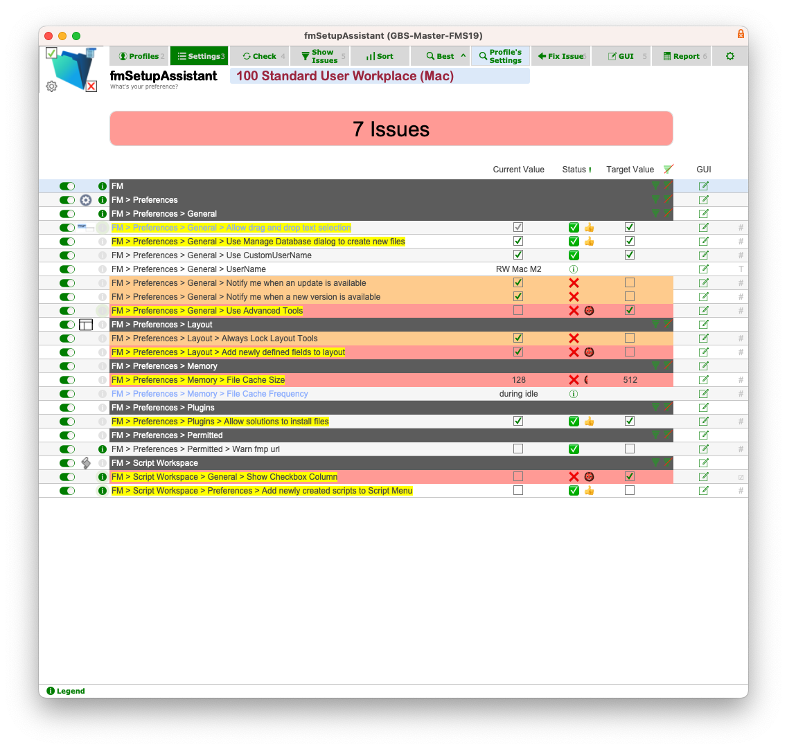

# fmSetupAssistant(⍺)
[Setup made easy]

fmSetupAssistant is an assistant to setup your FileMaker workstations easily and automatically.

**Important:** fmSetupAssistant(⍺) is Alpha Preview software, please read the disclaimer, below.

## fmSetupAssistant aims to…

- make setting up a Filemaker workstation as easy as possible
  - make it possible to get a quick overview of a Filemaker workstation setup
  - make manual setup of a Filemaker workstation quick and easy
  - facilitate setting up Filemaker workstations automatically
- integrate easily with your FileMaker solution

## With fmSetupAssistant…

…you can safely…

- get an instant report on the setup of a computer
- peruse filemaker & script preferences in one place
- jump directly to the respective preference dialog
  - indeed fmSetupAssistant can see (virtually) any preferences on the machine, system, finder, etc…
- use or create configuration profiles ('configs') to check a computer against a specific target setup

For example, in the above image you can see 3 issues - 2 errors and a warning.

## You can also…

- fix settings in one click (*) to make setting up a machine a matter of clicks
- apply a whole profile to setup a machine in a few clicks (*)

Please note that this software is in development and be sure to read the following caution,

## Disclaimer (⍺) Alpha Preview software

fmSetupAssistant is a new tool still in development (alpha phase). Whilst taking every precaution to make the software safe to use, there is no guarantee it will work

- fmSetupAssistant interacts directly with your preferences files/with the Windows registry, and can break them (causing FileMaker to crash on start), if a setting is written with the wrong data type.
- fmSetupAssistant thus starts in safe, read-only mode
- You **are reponsible for making a backup copy of your FileMaker preferences file(s) / FileMaker Registry Keys *before* using the automatic-setup / fix functionality**

## Recovering from broken preferences files

On Mac

- While irritating, all is not lost (just your preferences) The simple recovery from this situation is to delete the foul preferences file. The FileMaker prefs file is located at `*`~/Library/Preferences/com.filemaker.client.pro12.plist`*`

On Windows

- To be sure and safe use a Windows Recovery Point to make a return to a previous state possible.

## Contributions & Collaborations welcome!

Whether it be by using, testing, logging issues or sharing your ideas and opinions on this software / collaborating with mrwatson, please feel free to help improve this software and make this a power-tool for all FileMaker developers

# Links

- Home: https://fmworkmate.com/fmsetupassistant
- Repo: https://github.com/mrwatson-de/fmSetupAssistant
- Latest Release: https://github.com/mrwatson-de/fmSetupAssistant/releases/latest