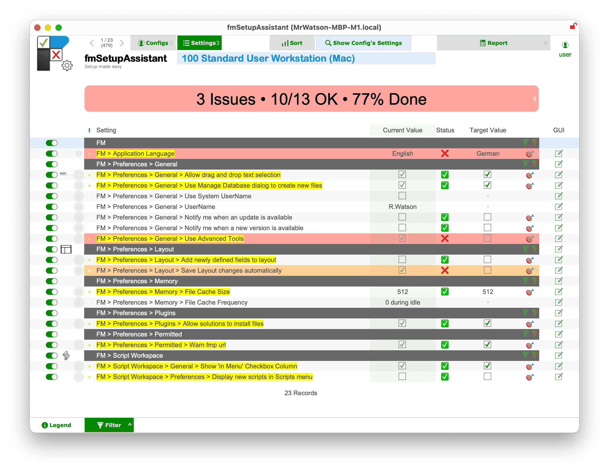

# fmSetupAssistant
[What's your preference?]

An assistant to setup your FileMaker workstations.

*Caution: fmSetupAssistant is Alpha Preview software(*)*

**With fmSetupAssistant you can (safely)…**

- get an instant report/list of setup-issues on the setup of a computer
- peruse filemaker & script preferences in one place
- jump directly to the respective preference dialog
  - indeed fmSetupAssistant can see (virtually) any preferences on the machine, system, finder, etc…
- use or create profiles to check a computer against a particular desired setup

**fmSetupAssistant aims to…**

- Fix settings in one click (*) to make setting up a machine a matter of clicks
- Apply a whole profile to setup a machine in a few clicks (*)

**Please help…**

…improve the software by logging issues or collaborating with mrwatson to make this a power-tool for all FileMaker developers!

---

(*) **Caution** 
- fmSetupAssistant is a new tool still in development (alpha phase).
- fmSetupAssistant interacts directly with your preferences files, and can break them (causing FileMaker to crash on start), if a setting is written with the wrong data type.
- fmSetupAssistant thus starts in safe, read-only mode
- While irritating, all is not lost (just your preferences) The simple recovery from this situation is to simply delete the foul preferences file.
- It is, however, thus recommended you **make a backup copy of your FileMaker preferences file(s) before using the automatic-setup / fix functionality**

# Links

- Home: https://fmworkmate.com/fmsetupassistant
- Repo: https://github.com/mrwatson-de/fmSetupAssistant
- Latest Release: https://github.com/mrwatson-de/fmSetupAssistant/releases/latest